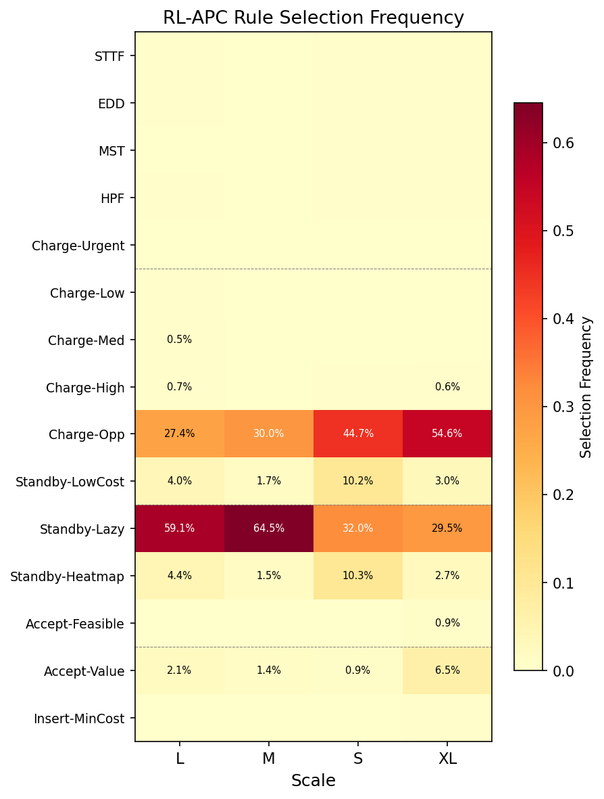

# Q3: RL 学到了什么？

> **结论: RL 学到了以"待命+机会充电"为核心的保守策略，不同 scale 下策略比例有系统性变化。**

## 规则选择频率热力图

### 各 Scale 的 Top-3 规则

| Scale | #1 | #2 | #3 | 特征 |
|-------|-----|-----|-----|------|
| S | Charge-Opp (44.7%) | Standby-Lazy (32.0%) | Standby-LowCost (10.2%) | 充电为主 |
| M | Standby-Lazy (64.5%) | Charge-Opp (30.0%) | Standby-LowCost (1.7%) | 待命为主 |
| L | Standby-Lazy (59.1%) | Charge-Opp (27.4%) | Standby-Heatmap (4.4%) | 待命为主 |
| XL | Charge-Opp (54.6%) | Standby-Lazy (29.5%) | Accept-Value (6.5%) | 充电为主 |

## 关键发现

### 1. 两条规则主导所有决策
Standby-Lazy + Charge-Opp 合计占 85-95% 的决策：
- S: 32.0% + 44.7% = **76.7%**
- M: 64.5% + 30.0% = **94.5%**
- L: 59.1% + 27.4% = **86.5%**
- XL: 29.5% + 54.6% = **84.1%**

### 2. Scale 影响策略比例
- **S/XL**: 偏向 Charge-Opp (机会充电) — 小规模和超大规模需要更积极的能量管理
- **M/L**: 偏向 Standby-Lazy (原地待命) — 中大规模下保守等待更有效

### 3. Dispatch 规则几乎不被使用
STTF, EDD, MST, HPF, Insert-MinCost 的选择频率均 < 0.5%。
- **解释**: 在事件驱动的仿真中，任务调度由 execution layer 自动处理，RL 在高层只需决定"充电/待命/接受"
- **论文意义**: 说明 RL 发现了一个违反直觉的有效策略 — "少做决策反而更好"

### 4. Accept-Value 在 XL 更活跃
XL-scale 的 Accept-Value 使用率 (6.5%) 远高于其他 scale (<2%)。
- XL 有更多任务到达事件，需要更频繁地做接受/拒绝决策

## 可解释性论证

RL-APC 的策略不是黑盒:
1. **核心策略清晰**: 待命 + 机会充电
2. **Scale 敏感性合理**: 规模越大，待命比例越高（保守策略）
3. **与 Q1 结论一致**: Standby-Lazy 是 S/M 的最优单规则，RL 大量使用它是合理的
4. **与 Q4 结论一致**: RL 不拒绝任务 (Accept-Value 使用率低) → 低拒绝率

## 对论文的意义

这个热力图可以支撑两个关键论点:
1. **可解释性**: RL 不是随机选择规则，而是学到了有结构的策略
2. **自适应性**: 不同 scale 下策略组成不同，这是固定规则做不到的

## 对应图表

- F3: `fig_rule_selection_heatmap.png` (Section 5.4)
- 数据: `rule_selection_heatmap.csv`, `rule_freq_{S,M,L,XL}.csv`
- 事件分解: `rule_event_breakdown_{S,M,L,XL}.csv`
