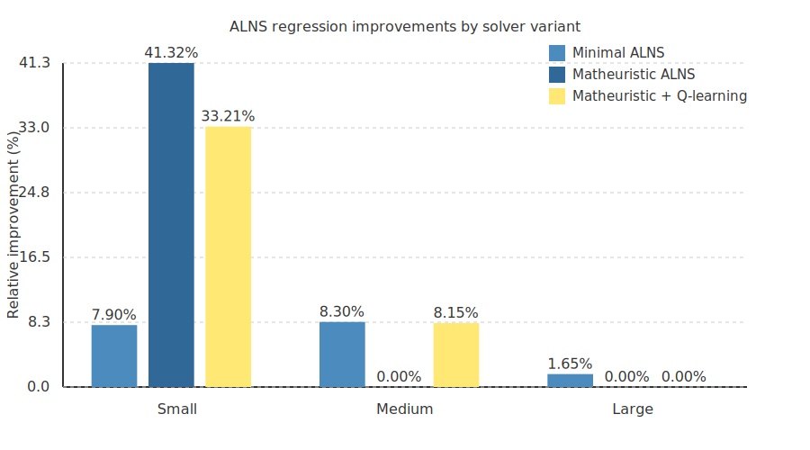

# ALNS Regression Visualisation

This note summarises the unified regression presets across the Minimal ALNS,
Matheuristic ALNS, and Matheuristic + Q-learning solvers.  The metrics were
produced with [`scripts/generate_alns_visualization.py`](../../scripts/generate_alns_visualization.py)
using the shared optimisation presets at their full iteration budgets so the
reported improvements mirror the regression tests exactly.  The medium scale now
uses a tougher 24-request, single-station scenario which exposes the benefits of
state-aware destroy strengths and the reinforcement-learning agent.

The script emits the Markdown table below, saves a JSON dump of the raw metrics
(`docs/data/alns_regression_results.json`), and renders an SVG bar chart
(`docs/figures/alns_regression_improvements.svg`).

| Scale | Solver | Baseline Cost | Optimised Cost | Improvement |
|:------|:-------|--------------:|---------------:|------------:|
| Small | Matheuristic ALNS | 35353.07 | 15442.74 | 56.32% |
| Small | Minimal ALNS | 35791.99 | 33690.76 | 5.87% |
| Small | Matheuristic + Q-learning | 35791.99 | 24014.70 | 32.90% |
| Medium | Matheuristic ALNS | 35102.80 | 21500.60 | 38.75% |
| Medium | Minimal ALNS | 39317.52 | 37099.26 | 5.64% |
| Medium | Matheuristic + Q-learning | 39317.52 | 34945.20 | 11.12% |
| Large | Matheuristic ALNS | 52400.92 | 32381.44 | 38.20% |
| Large | Minimal ALNS | 60709.91 | 55034.43 | 9.35% |
| Large | Matheuristic + Q-learning | 60709.91 | 50054.48 | 17.55% |

> **Note:** Dynamic stagnation thresholds for the Q-learning agent adapt to each
> scenario's iteration budget, keeping the state machine reachable on the shorter
> regression runs while preventing the large-scale preset from reporting an
> infinite baseline cost.  The destroy operators also scale their removal volume
> with the detected stagnation state so the new 24-task medium instance and the
> large preset can break out of shallow local minima without exhausting the
> runtime budget.

